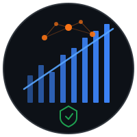

<p align="center">
  
</p>

<h1 align="center">Atlas</h1>
<p align="center">AI-Powered Equity Trading System</p>
<p align="center">
  <a href="LICENSE"></a>
  
</p>

---

## Overview

Project Atlas is an AI-powered equity trading system built on TradeStation's REST API v3. It screens ~150 liquid US equities, fetches Finnhub news, and uses Claude or Gemini to make real-time trading decisions with bracket orders (entry + stop loss + take profit).

Atlas uses a **protected floor model**: a $25K balance is never touched (maintaining PDT-exempt margin status), and all trading happens with active capital above that floor.

## Architecture

```
Market Open (every 5 min cycle)
  -> Stock Screener (150 symbols -> 5-10 candidates)
  -> Cold List Filter (demotes inactive symbols to hourly checks)
  -> Finnhub News Fetch
  -> Candidate Package Builder
  -> Market Regime Classifier (TREND_LONG / TREND_SHORT / REVERSAL_LONG / AVOID)
  -> AI Decision Engine (Claude Sonnet / Gemini Flash)
  -> Direction Enforcement (rejects trades violating regime's allowed_direction)
  -> Slippage Guard (rejects fills > 0.5% from expected price)
  -> Pydantic Schema Validation (R:R >= 2:1, TP >= 0.8%, SL >= 0.3%, SL <= 4%, TP <= 8%)
  -> Symbol Cooldown (30 min between re-entries on same ticker)
  -> Risk Checks + Order Manager
  -> TradeStation Bracket Orders
  -> Ledger Write (actual fill prices + fees)

  [If open positions exist]
  -> AI EXIT Evaluation (early close when thesis invalidates)
  -> Cancel Bracket + Market Close (atomic, with race condition protection)

Background (every 30s)
  -> Position Monitor (detects SL/TP fills in near-real-time)

Friday After Close
  -> Weekly Review (Claude Opus, stored in DB)
  -> Watchlist Rotation (Claude Opus, structured JSON diff)
  -> Withdrawal Calculation
```

## Prerequisites

### Broker Account

Atlas requires a TradeStation margin account with:

- **$25,000 minimum** to maintain the protected floor (avoids PDT restrictions on margin accounts)
- **$5,000+ trading capital** above the floor for active positions
- Recommended starting balance: **$30,000** ($25K floor + $5K active)

The $25K floor is never traded — it exists solely to keep the account above the Pattern Day Trader threshold. All position sizing, P&L tracking, and risk management operate on the active capital above this floor.

> **Sim accounts**: TradeStation sim accounts start with a configurable balance. Set yours to $30,000 before running Atlas.

### Software

- Python 3.12+ (via [pyenv](https://github.com/pyenv/pyenv) recommended)
- TradeStation account with API access
- Anthropic API key (required for weekly reviews; also for trading if using Claude)
- Finnhub API key (optional, improves decision quality with news)

## Quick Start

```bash
# 1. Setup Python environment
pyenv install 3.12.12
pyenv local 3.12.12
pip install -r requirements.txt

# 2. Customize your strategy (prompts and thresholds)
# Edit strategy/prompts.py and strategy/thresholds.py with your own trading logic

# 3. Configure credentials
cp .env.example .env
# Fill in your API keys (see "API Keys" section below)

# 4. Populate watchlist (10 sample symbols included — add 100-150 for best results)
# Edit data/watchlist.json

# 5. Authenticate with TradeStation
python main.py auth

# 6. Verify setup
python main.py setup

# 7. Run the trading loop (sim mode)
python main.py run
```

## API Keys

Atlas requires credentials from three services. All keys go in your `.env` file.

### TradeStation (required)

Broker API for market data, quotes, and order execution.

1. Create an account at [tradestation.com](https://www.tradestation.com)
2. Follow the [Authentication Guide](https://api.tradestation.com/docs/fundamentals/authentication/auth-overview) to create an application
3. Set your redirect URI (e.g., `https://your-domain.com/callback` or `http://localhost:8080/callback`)
4. Copy the key, secret, and your trading account ID

```env
TS_API_KEY=your_tradestation_api_key
TS_API_SECRET=your_tradestation_api_secret
TS_ACCOUNT_ID=your_account_id          # e.g., SIM1234567M for sim
TS_REDIRECT_URI=http://localhost:8080/callback
USE_SIM_ACCOUNT=true                    # ALWAYS true until live graduation
```

Then run `python main.py auth` to complete the OAuth2 flow and store your access token.

### Anthropic — Claude (required if `DECISION_PROVIDER=claude`)

AI provider for real-time trading decisions (Sonnet) and weekly reviews (Opus).

1. Sign up at [platform.claude.com](https://platform.claude.com/)
2. Go to **API Keys** → **Create Key**

```env
DECISION_PROVIDER=claude
ANTHROPIC_API_KEY=sk-ant-...
CLAUDE_DECISION_MODEL=claude-sonnet-4-20250514    # Trading decisions (~$0.01/cycle)
CLAUDE_REVIEW_MODEL=claude-opus-4-20250514        # Weekly review + watchlist rotation
```

Note: Weekly review and watchlist rotation always use Claude Opus regardless of `DECISION_PROVIDER`. If you use Gemini for decisions, you still need an Anthropic key for Friday reviews.

### Google — Gemini (required if `DECISION_PROVIDER=gemini`)

Alternative AI provider for trading decisions. Free tier available for sim testing.

1. Go to [aistudio.google.com](https://aistudio.google.com)
2. Click **Get API Key** → **Create API Key**

```env
DECISION_PROVIDER=gemini
GEMINI_API_KEY=AIza...
GEMINI_DECISION_MODEL=gemini-2.5-flash
```

### Finnhub (optional, recommended)

Company news headlines for trading catalyst detection.

1. Sign up at [finnhub.io](https://finnhub.io)
2. Free tier: 60 API calls/minute (sufficient for Atlas)
3. Copy your API key from the dashboard

```env
FINNHUB_API_KEY=your_finnhub_api_key
```

If not set, Atlas runs without news — the AI makes decisions on technicals only. News significantly improves decision quality, so this is strongly recommended.

## Strategy

The `strategy/` directory contains all trading logic — the AI prompts, screener thresholds, validation parameters, and ranking weights that define your edge. The repo ships with working defaults that you should customize.

**Files**:
- `strategy/prompts.py` — System prompts for trading decisions, weekly reviews, and watchlist rotation
- `strategy/thresholds.py` — Screener filters (price, volume, RSI, ATR), Pydantic validation (R:R, TP/SL distances), and candidate ranking weights

The defaults provide a working baseline. The alpha is in tuning these values to your market thesis. The infrastructure (screener, order manager, risk checks, position monitor) is generic — the strategy module is what makes it yours.

## Watchlist

The watchlist (`data/watchlist.json`) defines the symbols the screener evaluates each cycle. A sample with 10 symbols is included — populate it with 100-150 liquid US equities across sectors for best results.

**Format**: JSON array of `{symbol, sector}` entries:
```json
{
  "version": "1.0",
  "updated": "2026-03-12",
  "symbols": [
    {"symbol": "AAPL", "sector": "Technology"},
    {"symbol": "NVDA", "sector": "Technology"}
  ]
}
```

**Automatic rotation**: Every Friday after close, Claude Opus analyzes which symbols consistently pass or fail screening, reviews the week's trades, and outputs a structured diff:
- Up to 10 symbols removed (persistently failing screener filters)
- Up to 10 symbols added (based on market rotation and catalysts)
- Never removes symbols with open positions
- Every change is logged in the `watchlist_changes` DB table

**Cold list optimization**: Symbols that fail the price/spread filter 12 consecutive cycles (~1 hour) are demoted to hourly re-checks instead of every 5 minutes. They wake up instantly if they pass a filter or the hourly window expires. Cold stats persist across restarts via `data/cold_stats.json`.

## CLI Commands

| Command | Description |
|---------|-------------|
| `python main.py auth` | TradeStation OAuth2 authentication |
| `python main.py setup` | Verify account access and balance |
| `python main.py test-order` | Place and cancel a test order (sim) |
| `python main.py run` | Start the trading loop |
| `python main.py review [date]` | Run weekly review with Claude Opus (stored in DB) |
| `python main.py validate` | Check sim record against live graduation criteria |
| `python main.py ledger summary` | P&L summary statistics |
| `python main.py ledger trades` | List all trades with mode tags |
| `python main.py ledger withdrawals` | Withdrawal history |
| `python main.py ledger costs` | API cost breakdown |
| `python main.py ledger export` | Export trades and costs to CSV |

Use `--sim` or `--live` with ledger commands to filter by mode.

## Capital Structure

```
Total Sim Account:     $30,000
Protected Floor:       $25,000   <- never traded, maintains PDT-exempt status
Active Capital:         $5,000   <- all sizing, P&L, and targets use this
Effective Floor (SIM):           <- floor + cumulative withdrawals (simulates money out)
```

### Graduation Phases

| Phase | Active Capital | Mode |
|-------|---------------|------|
| Phase 1 -- Growth | $5K → $10K | Aggressive, no withdrawal |
| Phase 2 -- Withdrawal | $10K → $25K | Aggressive + 1% weekly withdrawal |
| Phase 3 -- Graduation | $25K+ | Reassess strategy with Opus |

## Risk Rules

- Max 3 concurrent positions
- Max 30% of active capital per trade
- Hard stop: trading pauses if active capital drops below 20% of start-of-day capital
- Every trade must have a stop loss (bracket order)
- No entries before 9:35 EST or after 15:45 EST
- Protected floor ($25K) is never breached
- Market regime classifier: TREND_LONG, TREND_SHORT, REVERSAL_LONG, or AVOID (filtered out)
- Reversal gate: requires RSI < 35 + MACD histogram rising + green candle (prevents falling knives)
- Symbol cooldown: 30 min (6 cycles) before re-entering a recently traded symbol
- Slippage guard: rejects fills > 0.5% from AI's expected entry price
- Pydantic validation: R:R >= 2:1, TP >= 0.8% from entry, SL >= 0.3% from entry, SL <= 4%, TP <= 8%
- AI EXIT action: early position close when thesis invalidates (1 exit per cycle, market order)
- Python-side share sizing: AI provides prices only, engine calculates position size

## AI Providers

| Provider | Use Case | Cost |
|----------|----------|------|
| Claude Sonnet | Real-time trading decisions (prompt cached) | ~$0.01/cycle |
| Claude Opus | Weekly review + watchlist rotation (Fridays) | ~$0.02-0.05/week |
| Gemini Flash | Sim testing (free tier) | $0 |

Set `DECISION_PROVIDER=claude` or `DECISION_PROVIDER=gemini` in `.env`.
Weekly review and watchlist rotation always use Claude Opus regardless of this setting.

## Live Transition

Atlas includes a phased live transition protocol:

1. **Sim Validation** (`python main.py validate`): 30+ trading days, positive P&L, >45% win rate
2. **Phase A** (`OPERATOR_APPROVAL=true`): Every trade requires manual approval
3. **Phase B** (`AUTO_APPROVE_AFTER=10`): Auto-approve after N approved trades
4. **Phase C**: Fully autonomous, operator reviews daily Opus report

All trades are tagged SIM or LIVE in the ledger for separate reporting.

## Project Structure

```
atlas/
├── main.py                     # CLI entry point
├── scheduler.py                # Main trading loop
├── src/
│   ├── api/
│   │   ├── tradestation.py     # TS REST API client (from Midas)
│   │   └── authenticate.py    # OAuth2 flow (from Midas)
│   ├── config/
│   │   └── constants.py        # All constants and thresholds
│   ├── screener/
│   │   ├── screener.py         # Universe filter + ranking + cold list
│   │   ├── indicators.py       # ATR, VWAP, RSI, relative volume, market regime
│   │   ├── news_fetcher.py     # Finnhub company news headlines
│   │   ├── candidate_builder.py # Data packages for AI
│   │   └── watchlist_rotation.py # Weekly Opus-driven watchlist updates
│   ├── engine/
│   │   ├── decision_engine.py  # AI decisions + Pydantic validation + share sizing
│   │   ├── schemas.py          # Pydantic models (TradeDecision, AIResponse)
│   │   ├── eod_review.py       # Claude Opus weekly review
│   │   ├── preflight.py        # Startup and validation checks
│   │   ├── operator_approval.py # Manual trade approval gate
│   │   └── providers/
│   │       ├── base.py         # DecisionProvider ABC
│   │       ├── claude.py       # Anthropic implementation
│   │       └── gemini.py       # Google implementation
│   ├── orders/
│   │   ├── order_manager.py    # Order execution + risk checks
│   │   └── position_monitor.py # Exit detection + ledger sync
│   ├── ledger/
│   │   ├── ledger.py           # SQLite audit trail (6 tables)
│   │   └── withdrawal_tracker.py # Weekly profit withdrawals
│   └── utils/
│       └── logging_config.py   # File-only logging (from Midas)
├── data/
│   ├── watchlist.example.json  # Seed watchlist template (150 symbols)
│   ├── watchlist.json          # Live watchlist (not in git, updated by Opus)
│   ├── cold_stats.json         # Cold list state (not in git)
│   └── atlas_ledger.db         # SQLite database (not in git)
├── strategy/                   # Trading strategy (prompts + thresholds — customize these)
├── tests/                      # 324 tests, all mocked
└── logs/                       # Rolling log files
```

## Testing

```bash
pytest tests/ -v                # Run all 324 tests
```

All tests use mocked API responses and in-memory SQLite -- no live credentials needed.

## Dependencies

```
aiohttp          # Async HTTP client
pandas           # Data manipulation
pandas-ta        # Technical indicators
python-dotenv    # Environment configuration
anthropic        # Claude AI provider
google-genai     # Gemini AI provider
pydantic         # Schema validation for AI responses
pytest           # Testing framework
pytest-asyncio   # Async test support
```

---

*Project Atlas -- AI-Powered Equity Trading System*
*Forked from the Midas futures trading platform*
